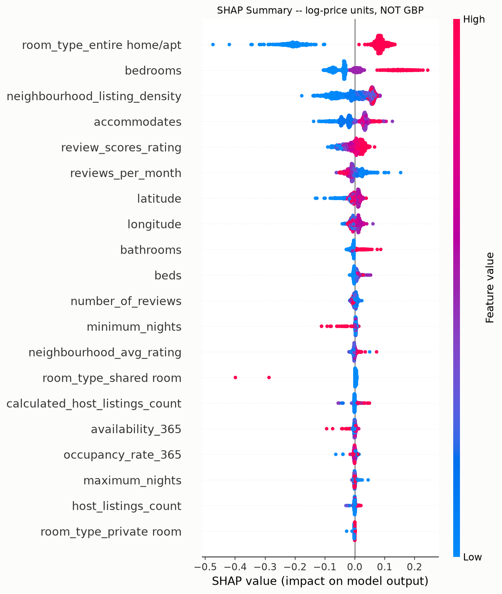
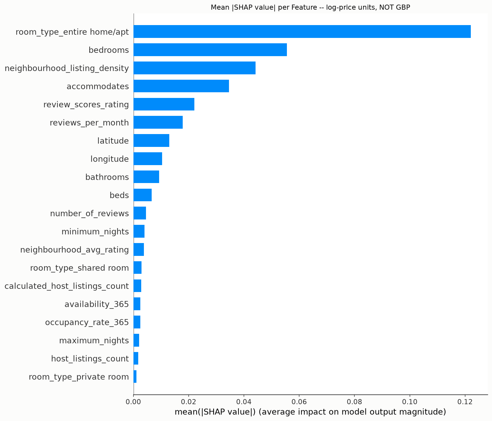

# Price Prediction Model Performance
Generated: 2026-07-12 18:37:15

## Setup
- Target: `log_price` (price skew=18.48, log10-transformed since |skew| > 1)
- Model: RandomForestRegressor(n_estimators=200, random_state=42)
- Train/test split: 80/20, random_state=42
- Rows used: 5025 (4020 train / 1005 test); 1219 rows dropped for missing values
- Excluded leakage features: neighbourhood_median_price, price_per_bedroom, estimated_annual_revenue, price_quote_total_price, price_quote_price_per_night (derived from price itself)
- Excluded unusable features: host_tenure_years (entirely null in this dataset)

## Test Set Performance (£ scale)

| Model | MAE (£) | RMSE (£) | R² |
|---|---|---|---|
| Mean baseline | 151.28 | 433.56 | -0.0009 |
| Random Forest (200 trees) | 86.52 | 406.27 | 0.1211 |

Random Forest reduces MAE by 42.8% and RMSE by 6.3% compared to always predicting the training-set mean price.

**Note on R² and scale:** the model is fit on `log_price`, where it explains 66.0% of variance (R²=0.6602) — better than the OLS regression's log-scale R² (0.550). The £-scale R² above is lower because a handful of extreme luxury listings (£1,000+/night) get pulled toward the bulk of the distribution by log-space training, and those few large misses dominate a squared-error metric once back-transformed to £. MAE/RMSE are still reported in £ since that's the business-relevant unit, but the log-scale R² is the fairer measure of how well the model captures price patterns overall.

## Top 10 Feature Importances

| Feature | Importance |
|---|---|
| room_type_entire home/apt | 0.3860 |
| bedrooms | 0.1331 |
| neighbourhood_listing_density | 0.0603 |
| accommodates | 0.0510 |
| reviews_per_month | 0.0450 |
| latitude | 0.0437 |
| review_scores_rating | 0.0353 |
| longitude | 0.0331 |
| minimum_nights | 0.0328 |
| number_of_reviews | 0.0230 |

## SHAP Feature Impact

SHAP (TreeExplainer) values below are computed on `log_price` -- log-price units, not £. A log-scale contribution doesn't translate to a fixed pound amount (its £ effect depends on the listing's baseline price), so these are described directionally/relatively only, never quantified in £.

**Top 5 drivers of predicted price:**

1. **room_type_entire home/apt** -- being 'entire home/apt' (room type) is the strongest positive driver of predicted price relative to the other room type categories.
2. **bedrooms** -- higher bedrooms increases predicted price; it is one of the strongest drivers of the model's predictions overall.
3. **neighbourhood_listing_density** -- higher neighbourhood_listing_density increases predicted price; it is one of the strongest drivers of the model's predictions overall.
4. **accommodates** -- higher accommodates increases predicted price; it is one of the strongest drivers of the model's predictions overall.
5. **review_scores_rating** -- higher review_scores_rating increases predicted price; it is one of the strongest drivers of the model's predictions overall.
